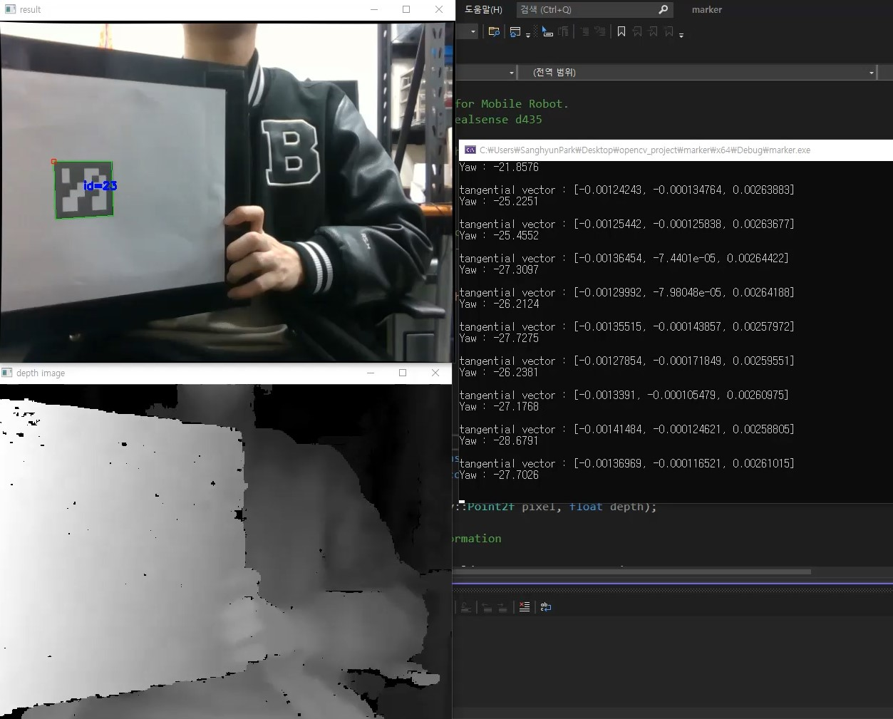
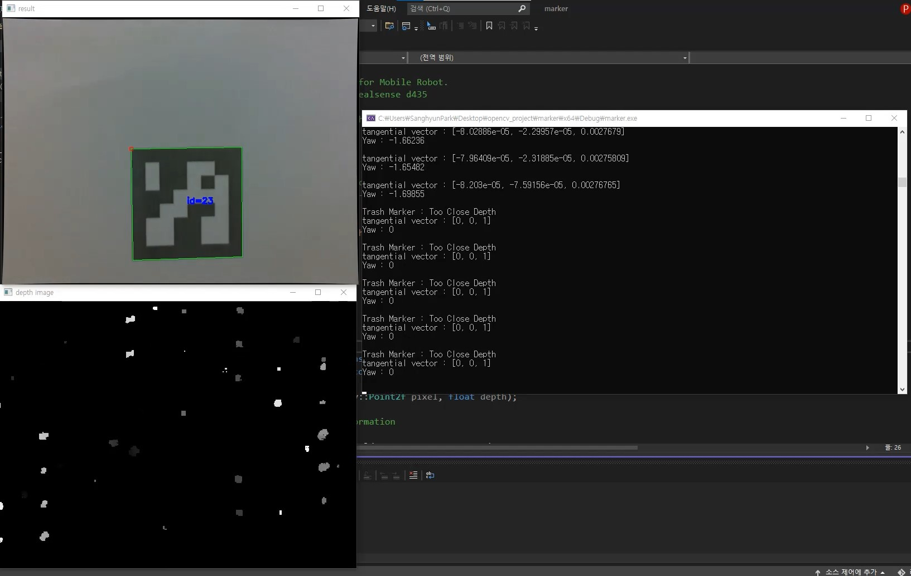

# Yaw-Estimation
This is Yaw-Estimation for Mobile Robot. It use ArUco Marker and Intel Realsense D435.  
I made it for docking.

# 🛠️Setting
|Settings|Version|
|:---:|:---:|
|OS|Windows 10|
|Language|C++|
|IDE|Visual Studio 2022|
|OpenCV|4.5.5|
|Realsense|D435|
  

* Install [librealsense](https://github.com/IntelRealSense/librealsense)
* Install [OpenCV](https://github.com/opencv/opencv), [Opencv Module](https://github.com/opencv/opencv_contrib)

# 🛠️Run

## **1-1(Image)**

  

## **1-2(Video)**

  

## **2-1(Image)**

  

## **2-2(Video)**

  

# 🛠️License
`Yaw-Estimation` is under the [MIT License](https://github.com/SanghyunPark01/Yaw-Estimation/blob/main/LICENSE)

# 🛠️Contact
If you find error, **please** Contact me  
* E-mail : pash0302@naver.com
<<<<<<< HEAD
* E-mail : pash0302@gmail.com
=======
* E-mail : pash0302@gmail.com
>>>>>>> 9cb599804c2af018d14ff6b020dbd9f640d724fc
